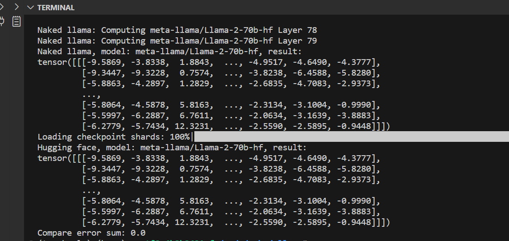

# naked_llama

build llama inference compute from scrath, only using torch/numpy base ops

## install

```bash
pip install torch >= 2.1.0

# transformers is used for convert model weights and compare results
pip install transformers >= 4.35.2

```

## excute & result

```bash
git clone https://github.com/silencelamb/naked_llama.git

# default model_size is 7b
python naked_llama.py

```


```bash
# run 70 b
python naked_llama.py --model_size 70b

```



## references

- [llama in huggingface transformers](https://github.com/huggingface/transformers/blob/main/src/transformers/models/llama/modeling_llama.py)
- [meta official llama repo](https://github.com/meta-llama/llama/blob/main/llama/model.py)
